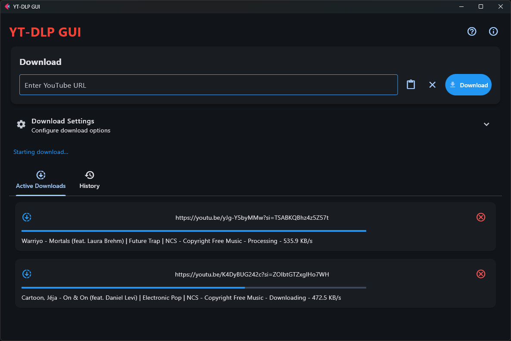

# YT-DLP GUI

A beautiful, comprehensive flutter-based desktop client for downloading YouTube content using [yt-dlp](https://github.com/yt-dlp/yt-dlp).

- Clean, responsive interface with dark mode
- Track active downloads with progress bars and download history
- Choose from various video/audio formats and quality options
- Download just the audio in various formats (MP3, M4A, etc.)
- Support for subtitles, playlists, thumbnails, and more
- Import/export your download settings



## Installation

You need python 3.12+ installed. Run:

```
pip install ytdlp-gui
```

## Usage

Run:

```
ytdlpg
```

### Basic Usage:

1. Enter a YouTube URL in the input field
2. Configure download options if needed
3. Click the Download button
4. Monitor progress in the Active Downloads tab
5. View completed downloads in the History tab

## Requirements

- Python 3.12+
- yt-dlp
- flet
- ffmpeg (for audio conversion)

# Reporting Issues

If you encounter any issues, please report them on the [GitHub Issues](https://github.com/tomlin7/ytdlp-gui/issues) page.

## License

MIT

## Contributing

Contributions are welcome! Please feel free to submit a Pull Request.

## Acknowledgements

- [yt-dlp](https://github.com/yt-dlp/yt-dlp) for the amazing downloader tool
- [Flet](https://flet.dev/) for the Flutter-powered Python UI framework
